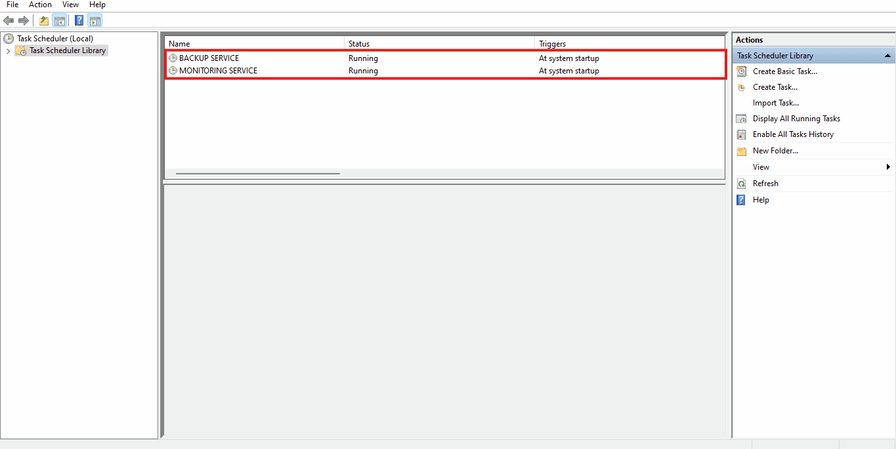

# **Table of Content**

- [**Table of Content**](#table-of-content)
- [**Introduction**](#introduction)
  - [**Overview**](#overview)
  - [**Target Platforms**](#target-platforms)
  - [**Target Audience**](#target-audience)
  - [**Key Advantages**](#key-advantages)
- [**Getting Started**](#getting-started)
  - [**Strict Access Time** | ***(only relevant for Linux)***](#strict-access-time--only-relevant-for-linux)
  - [**Installation**](#installation)
  - [**Usage**](#usage)
- [**Core Features**](#core-features)
  - [**Monitoring Service**](#monitoring-service)
  - [**Backup Service**](#backup-service)
  - [**Monitoring Log Viewer**](#monitoring-log-viewer)
  - [**Notes on Core Features**](#notes-on-core-features)
- [**Walkthrough Examples**](#walkthrough-examples)
  - [**Strict Access Time** - ***Manual Enablement*** | ***(only relevant for Linux)***](#strict-access-time---manual-enablement--only-relevant-for-linux)
  - [**Strict Access Time** - ***Manual Disablement*** | ***(only relevant for Linux)***](#strict-access-time---manual-disablement--only-relevant-for-linux)
  - [**Initial Setup** - ***Recommended Approach***](#initial-setup---recommended-approach)
  - [**Initial Setup** - ***Discouraged Approach***](#initial-setup---discouraged-approach)
  - [**Monitoring Service** - ***Directory Monitoring Configurator***](#monitoring-service---directory-monitoring-configurator)
  - [**Monitoring Service** - ***File Monitoring Configurator***](#monitoring-service---file-monitoring-configurator)
  - [**Monitoring Service** - ***Directory Monitoring Remover***](#monitoring-service---directory-monitoring-remover)
  - [**Monitoring Service** - ***File Monitoring Remover***](#monitoring-service---file-monitoring-remover)
  - [**Backup Service** - ***Directory Backup Configurator***](#backup-service---directory-backup-configurator)
  - [**Backup Service** - ***File Backup Configurator***](#backup-service---file-backup-configurator)
  - [**Backup Service** - ***Directory Backup Remover***](#backup-service---directory-backup-remover)
  - [**Backup Service** - ***File Backup Remover***](#backup-service---file-backup-remover)
  - [**Monitoring Log Viewer** - ***Directory Monitoring Log Viewer***](#monitoring-log-viewer---directory-monitoring-log-viewer)
  - [**Monitoring Log Viewer** - ***File Monitoring Log Viewer***](#monitoring-log-viewer---file-monitoring-log-viewer)
  - [**Backup Inspection** - ***Directory Backup Inspection***](#backup-inspection---directory-backup-inspection)
  - [**Backup Inspection** - ***File Backup Inspection***](#backup-inspection---file-backup-inspection)
  - [**Settings** - ***Language Modification***](#settings---language-modification)
  - [**Settings** - ***Monitoring Directory Modification***](#settings---monitoring-directory-modification)
  - [**Settings** - ***Backup Directory Modification***](#settings---backup-directory-modification)
  - [**Settings** - ***Monitoring Service Toggling***](#settings---monitoring-service-toggling)
  - [**Settings** - ***Backup Service Toggling***](#settings---backup-service-toggling)
  - [**Settings** - ***Requirements Toggling***](#settings---requirements-toggling)
  - [**Notes on Walkthrough Examples**](#notes-on-walkthrough-examples)

# **Introduction**

## **Overview**

+ ***M&B*** is a command-line tool designed to address a variety of **security challenges**.

+ It provides solutions for &#8594;

  + Preventing unauthorized access and data alteration.
   
  + Mitigating risks associated with insider threats.
  
  + Protecting against data loss.
  
  + Guarding against unauthorized data extraction.
  
  + Improving the process of liability tracking.

> <br>**Note &#8594;** ***M&B*** is designed to be compatible with all generations of **NTFS** and **EXT** file systems.<br><br>

## **Target Platforms**

+ ***M&B*** provides support and functionality on **Windows**.

+ ***M&B*** is designed to operate on **Linux distributions**, which are often utilized for server operations.

> <br>**Note #1 &#8594;** **Windows 11** was chosen from various Windows operating systems for testing ***M&B***.<br><br>

> <br>**Note #2 &#8594;** **Debian 12** was selected from the wide range of available Linux distributions for testing ***M&B***.<br><br>

## **Target Audience**
+ ***M&B*** is particularly beneficial for several types of businesses, including &#8594;

  + Those focused on IT services.
  
  + Those operating in the digital space.
  
  + Those driven by data.

> <br>**Note &#8594;** Sysadmins are required to operate this tool, as it necessitates **administrator** or **root** access.<br><br>

## **Key Advantages**

+ Detecting unauthorized access attempts.
  
+ Identifying instances of data alteration.

+ Uncovering potential data extraction activities.

+ Recognizing and addressing insider threats.

+ Streamlining the process of liability tracking.

+ Reducing the risk of data loss.

+ Facilitating log reviews for greater insight.

+ Spotting suspicious activities.

+ Enabling recovery of older data backups.

+ Allowing restoration of updated data versions.

# **Getting Started**

## **Strict Access Time** | ***(only relevant for Linux)***

+ **Strict Access Time** ensures that the access timestamps of files are refreshed each time a file is accessed.
  
+ **Strict Access Time** allows for **precise** monitoring of file activity.

+ **Linux** systems use ***```relatime```***, which updates the access time only if it is **earlier than** the modification time. 

+ The use of ***```relatime```*** may lead to **incorrect access detection** with the **Monitoring Service**.

+ ***```relatime```*** does not impact modification detection.
  
+ ***For toggling Strict Access Time on your Linux system, please consult the following &#8594;***
    + [**Strict Access Time** - ***Manual Enablement*** | ***(only relevant for Linux)***](#strict-access-time---manual-enablement--only-relevant-for-linux)
    + [**Strict Access Time** - ***Manual Disablement*** | ***(only relevant for Linux)***](#strict-access-time---manual-disablement--only-relevant-for-linux)

> <br>**Note &#8594;** **Windows** operating systems employ a concept similar to ***```relatime```***, but enabling strict access time behavior can be done effortlessly via a command, which ***M&B*** seeks to **automate** with **admin** approval.<br><br>

## **Installation**

> <br>**Note &#8594;** Install Python 3 and configure it properly. Be sure to choose the latest version available.<br><br>

+ Retrieve the zipped code base and unpack it.
   
+ Relocate the extracted folder to a safe location of your choice.

+ Access the codebase directory and launch a command prompt.

> <br>**Note &#8594;** ***M&B*** is a zero-dependency solution, so setting up a virtual environment is **not required**.<br><br>

## **Usage**
+ Verify that you are positioned at the top level of the project folder, and then execute &#8594;

  ```shell
  # Windows
  python main.py

  # Linux
  python3 main.py
  ```

> <br> **Note &#8594;** ***M&B*** offers a **guided setup**, and ***```you can start it with a simple invocation command.```***<br><br>

# **Core Features**
## **Monitoring Service**

+ The **Monitoring Service** keeps track of files and directories for any **access** or **modification** activities.

+ It has the ability to track file system components categorized as **file** and **directory**.

+ When a directory is being monitored, **all files** contained within that directory are considered **targets**.

+ It generates relevant **log files** in the specified **central monitoring directory**.
  
+ Upon detecting access or modification on target files and directories, the service creates a **log entry**.

+ Each log entry contains the following information &#8594;

    + The **name of the target** (target file or file within target directory)

    + The **type of operation** performed (whether it was access or modification)

    + A **timestamp** with precision up to seconds.

    + A list of **users currently logged** into the system.

> <br>**Note #1 &#8594;** Any **subfolders** inside target directories are **excluded** from monitoring.<br><br>

> <br>**Note #2 &#8594;** **Central monitoring directory** is designated during the initial guided setup process.<br><br>

> <br>**Note #3 &#8594;** **Central monitoring directory** can be modified while the **Monitoring Service** is active.<br><br>

> <br>**Note #4 &#8594;** Switching the central monitoring directory **requires** the restart of the **Monitoring Service**.<br><br>

> <br>**Note #5 &#8594;** The extension **```.log```** is used to clearly signify **monitoring log files**.<br><br>

## **Backup Service**

+ The **Backup Service** keeps track of **modifications** to target files and directories.

+ It has the ability to track filesystem components categorized as **file** and **directory**.

+ When a directory is being tracked, **all files** contained within that directory are considered **targets**.

+ When a target is registered, an **initial backup** is stored in the **central backup directory**.

+ A new **timestamped backup** is created in the designated location whenever a **modification** occurs.

> <br> **Note #1 &#8594;** Any **subfolders** inside target directories are **excluded** from backup.<br><br>

> <br> **Note #2 &#8594;** **Central backup directory** is designated during the initial guided setup process.<br><br>

> <br> **Note #3 &#8594;** **Central backup directory** can be modified while the **Backup Service** is active.<br><br>

> <br> **Note #4 &#8594;** Switching the central backup directory **requires** the restart of the **Backup Service**.<br><br>

> <br> **Note #5 &#8594;** **Backup file names** consistently end with the format **```{TIMESTAMP}.bak```**<br><br>

> <br> **Note #6 &#8594;** The extension **```.bak```** is used to clearly signify **backup files**.<br><br>

> <br> **Note #7 &#8594;** Sysadmins **must** directly access the **central backup directory** to examine and leverage backups.<br><br>

## **Monitoring Log Viewer**

+ The **Monitoring Log Viewer** is designed to help sysadmins open **log files** for review and analysis.

+ Sysadmins do **not** need to recall which log file corresponds to which target.

+ The **Monitoring Log Viewer** handles all the mapping, formatting, and displaying of **log entries**.

+ It reduces the **challenges** of navigating and analyzing logs.

> <br>**Note &#8594;** Sysadmins **can** still directly access the **central monitoring directory** to examine **log files** and **log entries**.<br><br>

## **Notes on Core Features**

+ **User inputs** essentially consists of navigation options, file paths, or confirmation options.

+ When users enter any input, **validation checks** are conducted to ensure validity and accuracy.

+ To ensure that validation criteria are abided by, every screen showcases its **respective input criteria**.

+ At any point, users have the ability to **gracefully abort** any operation mid-way.

# **Walkthrough Examples**

## **Strict Access Time** - ***Manual Enablement*** | ***(only relevant for Linux)***


> <br> **Note #1 &#8594;** This does **not require** restarting the **Linux** system.<br><br>

> <br> **Note #2 &#8594;** Be sure **not** to make any typos as **manual editing** can be quite **risky** and results in a **broken system**.<br><br>

## **Strict Access Time** - ***Manual Disablement*** | ***(only relevant for Linux)***


> <br> **Note #1 &#8594;** This does **not require** restarting the **Linux** system.<br><br>

> <br> **Note #2 &#8594;** Be sure **not** to make any typos as **manual editing** can be quite **risky** and results in a **broken system**.<br><br>

## **Initial Setup** - ***Recommended Approach***


> <br> **Note #1 &#8594;** Ensure that the **central monitoring directory** is existent, is empty, and that you have permissions.<br><br>

> <br> **Note #2 &#8594;** Ensure that the **central backup directory** is existent, is empty, and that you have permissions.<br><br>

> <br> **Note #3 &#8594;** When picking a spot for the **central monitoring directory**, ensure a level of **confidentiality** in doing so.<br><br>

> <br> **Note #4 &#8594;** When picking a spot for the **central backup directory**, ensure a level of **confidentiality** in doing so.<br><br>

> <br> **Note #5 &#8594;** Enabling the **Monitoring Service** requires **admin** or **root** privileges, which the app tries to acquire.<br><br>

> <br> **Note #6 &#8594;** Enabling the **Monitoring Service** starts it and registers a **task** that starts on **boot** on **Windows**.<br><br>

> <br> **Note #7 &#8594;** Enabling the **Monitoring Service** starts it and creates a **cronjob** that starts on **boot** on **Linux**.<br><br>

> <br> **Note #8 &#8594;** Enabling the **Backup Service** requires **admin** or **root** privileges, which the app tries to acquire.<br><br>

> <br> **Note #9 &#8594;** Enabling the **Backup Service** starts it and registers a **task** that starts on **boot** on **Windows**.<br><br>

> <br> **Note #10 &#8594;** Enabling the **Backup Service** starts it and creates a **cronjob** that starts on **boot** on **Linux**.<br><br>

> <br> **Note #11 &#8594;** If you prefer **not** to use both services **simultaneously**, you can simply **enable** the one you need.<br><br>

> <br> **Note #12 &#8594;** **Task Scheduler** and **Task Manager** show the registering of **services** and their **background execution**.<br><br>

> <br> **Note #13 &#8594;** The **JSON file** contains all necessary information related to **core features** of the application.<br><br>

> <br> **Note #14 &#8594;** It is recommended **not** to manually edit the **JSON file**, as any **errors** in formatting **disrupt** services.<br><br>

> <br> **Note #15 &#8594;** The **JSON file** was displayed to showcase the **recommended** values.<br><br>

## **Initial Setup** - ***Discouraged Approach***


> <br> **Note #1 &#8594;** Ensure that the **central monitoring directory** is existent, is empty, and that you have  permissions.<br><br> 

> <br> **Note #2 &#8594;** Ensure that the **central backup directory** is existent, is empty, and that you have permissions.<br><br>

> <br> **Note #3 &#8594;** When picking a spot for the **central monitoring directory**, ensure a level of **confidentiality** in doing so.<br><br>

> <br> **Note #4 &#8594;** When picking a spot for the **central backup directory**, ensure a level of **confidentiality** in doing so.<br><br>

> <br> **Note #5 &#8594;** Setting the **Monitoring Service** as **disabled** is **discouraged**.<br><br>

> <br> **Note #6 &#8594;** Setting the **Monitoring Service** as **disabled** does **not** start it and does **not** register a **task** on **Windows**.<br><br>

> <br> **Note #7 &#8594;** Setting the **Monitoring Service** as **disabled** does **not** start it and does **not** create a **cronjob** on **Linux**.<br><br>

> <br> **Note #8 &#8594;** Setting the **Backup Service** as **disabled** is **discouraged**.<br><br>

> <br> **Note #9 &#8594;** Setting the **Backup Service** as **disabled** does **not** start it and does **not** register a **task** on **Windows**.<br><br>

> <br> **Note #10 &#8594;** Setting the **Backup Service** as **disabled** does **not** start it and does **not** create a **cronjob** on **Linux**.<br><br>

> <br> **Note #11 &#8594;** If you prefer **not** to use both services **simultaneously**, you can **disable** the one you do **not** need.<br><br>

> <br> **Note #12 &#8594;** **Task Scheduler** and **Task Manager** show the **abscence** of tasks and their background execution.<br><br>

> <br> **Note #13 &#8594;** The **JSON file** contains all necessary information related to **core features** of the application.<br><br>

> <br> **Note #14 &#8594;** It is recommended **not** to manually edit the **JSON file**, as any **errors** in formatting **disrupt** services.<br><br>

> <br> **Note #15 &#8594;** The **JSON file** was displayed to showcase the **discouraged** values.<br><br>

## **Monitoring Service** - ***Directory Monitoring Configurator***


> <br> **Note #1 &#8594;** The **JSON file** contains all necessary information related to the **tracked targets**.<br><br>

> <br> **Note #2 &#8594;** It is recommended **not** to manually edit the **JSON file**, as any **errors** in formatting **disrupt** services.<br><br>

> <br> **Note #3 &#8594;** The **JSON file** was displayed to indicate that the **target file** is **being tracked**.<br><br>

> <br> **Note #4 &#8594;** The **path** for the **target directory** must be **absolute** as **relative paths** are **not supported**.<br><br>

> <br> **Note #5 &#8594;** The **path** that points to the **directory** must be existing and the current user must have permissions.<br><br>

## **Monitoring Service** - ***File Monitoring Configurator***


> <br> **Note #1 &#8594;** The **JSON file** contains all necessary information related to the **tracked targets**.<br><br>

> <br> **Note #2 &#8594;** It is recommended **not** to manually edit the **JSON file**, as any **errors** in formatting **disrupt** services.<br><br>

> <br> **Note #3 &#8594;** The **JSON file** was displayed to indicate that the **target file** is **being tracked**.<br><br>

> <br> **Note #4 &#8594;** The **path** for the **target file** must be **absolute** as **relative paths** are **not supported**.<br><br>

> <br> **Note #5 &#8594;** The **path** that points to the **file** must be existing and the current user must have permissions.<br><br>

## **Monitoring Service** - ***Directory Monitoring Remover***


> <br> **Note #1 &#8594;** The **JSON file** contains all necessary information related to the **tracked targets**.<br><br>

> <br> **Note #2 &#8594;** It is recommended **not** to manually edit the **JSON file**, as any **errors** in formatting **disrupt** services.<br><br>

> <br> **Note #3 &#8594;** The **JSON file** was displayed to indicate that the **target directory** is **no longer** being tracked.<br><br>

> <br> **Note #4 &#8594;** If **no** target directories are present, the application will **notify** the user of this.<br><br>

> <br> **Note #5 &#8594;** When a **target directory** is **removed** from the list of tracked targets, **all respective monitoring logs** will be relocated to the **```orphanage```** directory within the **central monitoring directory** for safekeeping.<br><br>

## **Monitoring Service** - ***File Monitoring Remover***


> <br> **Note #1 &#8594;** The **JSON file** contains all necessary information related to the **tracked targets**.<br><br>

> <br> **Note #2 &#8594;** It is recommended **not** to manually edit the **JSON file**, as any **errors** in formatting **disrupt** services.<br><br>

> <br> **Note #3 &#8594;** The **JSON file** was displayed to indicate that the **target file** is **no longer** being tracked.<br><br>

> <br> **Note #4 &#8594;** If **no** target files are present, the application will **notify** the user of this.<br><br>

> <br> **Note #5 &#8594;** When a **target file** is **removed** from the list of tracked targets, **all respective monitoring logs** will be relocated to the **```orphanage```** directory within the **central backup directory** for safekeeping.<br><br>

## **Backup Service** - ***Directory Backup Configurator***


> <br> **Note #1 &#8594;** The **JSON file** contains all necessary information related to the **tracked targets**.<br><br>

> <br> **Note #2 &#8594;** It is recommended **not** to manually edit the **JSON file**, as any **errors** in formatting **disrupt** services.<br><br>

> <br> **Note #3 &#8594;** The **JSON file** was displayed to indicate that the **target file** is **being tracked**.<br><br>

> <br> **Note #4 &#8594;** The **path** for the **target directory** must be **absolute** as **relative paths** are **not supported**.<br><br>

> <br> **Note #5 &#8594;** The **path** that points to the **directory** must be existing and the current user must have permissions.<br><br>

## **Backup Service** - ***File Backup Configurator***


> <br> **Note #1 &#8594;** The **JSON file** contains all necessary information related to the **tracked targets**.<br><br>

> <br> **Note #2 &#8594;** It is recommended **not** to manually edit the **JSON file**, as any **errors** in formatting **disrupt** services.<br><br>

> <br> **Note #3 &#8594;** The **JSON file** was displayed to indicate that the **target file** is **being tracked**.<br><br>

> <br> **Note #4 &#8594;** The **path** for the **target file** must be **absolute** as **relative paths** are **not supported**.<br><br>

> <br> **Note #5 &#8594;** The **path** that points to the **file** must be existing and the current user must have permissions.<br><br>

## **Backup Service** - ***Directory Backup Remover***


> <br> **Note #1 &#8594;** The **JSON file** contains all necessary information related to the **tracked targets**.<br><br>

> <br> **Note #2 &#8594;** It is recommended **not** to manually edit the **JSON file**, as any **errors** in formatting **disrupt** services.<br><br>

> <br> **Note #3 &#8594;** The **JSON file** was displayed to indicate that the **target directory** is **no longer** being tracked.<br><br>

> <br> **Note #4 &#8594;** If **no** target directories are present, the application will **notify** the user of this.<br><br>

> <br> **Note #5 &#8594;** When a **target directory** is **removed** from the list of tracked targets, **all respective backups** will be relocated to the **```orphanage```** directory within the **central backup directory** for safekeeping.<br><br>

## **Backup Service** - ***File Backup Remover***


> <br> **Note #1 &#8594;** The **JSON file** contains all necessary information related to the **tracked targets**.<br><br>

> <br> **Note #2 &#8594;** It is recommended **not** to manually edit the **JSON file**, as any **errors** in formatting **disrupt** services.<br><br>

> <br> **Note #3 &#8594;** The **JSON file** was displayed to indicate that the **target file** is **no longer** being tracked.<br><br>

> <br> **Note #4 &#8594;** If **no** target files are present, the application will **notify** the user of this.<br><br>

> <br> **Note #5 &#8594;** When a **target file** is **removed** from the list of tracked targets, **all respective backups** will be relocated to the **```orphanage```** directory within the **central backup directory** for safekeeping.<br><br>

## **Monitoring Log Viewer** - ***Directory Monitoring Log Viewer***


> <br> **Note #1 &#8594;** The **Monitoring Service** is supposed to be **activated** and **is running**.<br><br>

> <br> **Note #2 &#8594;** The **```echo```** command **mimics** the **modification** by overwriting files contents of the target directory.<br><br>

> <br> **Note #3 &#8594;** The **```cat```** command **mimics** the **access** by opening files of the target directory to view their content.<br><br>

> <br> **Note #4 &#8594;** The **Monitoring Service** excells at detection of access and modifications **regardless of medium**.<br><br>

> <br> **Note #5 &#8594;** The display of the **monitoring log file** shows the appending of the **log entry** and its **structure**.<br><br>

> <br> **Note #6 &#8594;** The display of the **monitoring log file** shows the **formatting** done by the **Monitoring Log Viewer**.<br><br>

## **Monitoring Log Viewer** - ***File Monitoring Log Viewer***


> <br> **Note #1 &#8594;** The **Monitoring Service** is supposed to be **activated** and **is running**.<br><br>

> <br> **Note #2 &#8594;** The **```echo```** command **mimics** the **modification** by overwriting the target file content.<br><br>

> <br> **Note #3 &#8594;** The **```cat```** command **mimics** the **access** by opening the target file to view its content.<br><br>

> <br> **Note #4 &#8594;** The **Monitoring Service** excells at detection of access and modifications **regardless of medium**.<br><br>

> <br> **Note #5 &#8594;** The display of the **monitoring log file** shows the appending of the **log entry** and its **structure**.<br><br>

> <br> **Note #6 &#8594;** The display of the **monitoring log file** shows the **formatting** by the **Monitoring Log Viewer**.<br><br>

## **Backup Inspection** - ***Directory Backup Inspection***


> <br> **Note #1 &#8594;** **Task Scheduler** shows the proper **registering** and **background execution** of services.<br><br>

> <br> **Note #2 &#8594;** The **```echo```** command **mimics** the **modification** by overwriting the file contents of the target directory.<br><br>

> <br> **Note #3 &#8594;** The **```cat```** command **mimics** the **access** by opening files of the target directory to view their content.<br><br>

> <br> **Note #4 &#8594;** The **Backup Service** excells at detection of modifications **regardless of the medium**.<br><br>

## **Backup Inspection** - ***File Backup Inspection***


> <br> **Note #1 &#8594;** **Task Scheduler** shows the proper **registering** and **background execution** of services.<br><br>

> <br> **Note #2 &#8594;** The **```echo```** command **mimics** the **modification** by overwriting the target file content.<br><br>

> <br> **Note #3 &#8594;** The **```cat```** command **mimics** the **access** by opening the target file to view its content.<br><br>

> <br> **Note #4 &#8594;** The **Backup Service** excells at detection of modifications **regardless of the medium**.<br><br>

## **Settings** - ***Language Modification***


> <br> **Note &#8594;** Modifying the **language** can be done **without** needing to **restart** the main script or any services.<br><br>

## **Settings** - ***Monitoring Directory Modification***


> <br> **Note &#8594;** Modifying the **Monitoring Directory** while the **Monitoring Service** is running **requires** [**Service Toggling**](#settings---monitoring-service-toggling).<br><br>

## **Settings** - ***Backup Directory Modification***


> <br> **Note &#8594;** Modifying the **Backup Directory** while the **Backup Service** is running **requires** [**Service Toggling**](#settings---backup-service-toggling).<br><br>

## **Settings** - ***Monitoring Service Toggling***


> <br> **Note #1 &#8594;** Toggling the **Monitoring Service** requires **admin** or **root** privileges, which the app tries to acquire.<br><br>

> <br> **Note #2 &#8594;** Enabling the **Monitoring Service** starts it and creates a **task** that starts on **boot** on **Windows**.<br><br>

> <br> **Note #3 &#8594;** Enabling the **Monitoring Service** starts it and creates a **cronjob** that starts on **boot** on **Linux**.<br><br>

> <br> **Note #4 &#8594;** Disabling the **Monitoring Service** stops it and removes it from the **Task Scheduler** on **Windows**.<br><br>

> <br> **Note #5 &#8594;** Disabling the **Monitoring Service** stops it and removes it from the **Crontab of root** on **Linux**.<br><br>

## **Settings** - ***Backup Service Toggling***


> <br> **Note #1 &#8594;** Toggling the **Backup Service** requires **admin** or **root** privileges, which the app tries to acquire.<br><br>

> <br> **Note #2 &#8594;** Enabling the **Backup Service** starts it and creates a **task** that starts on **boot** on **Windows**.<br><br>

> <br> **Note #3 &#8594;** Enabling the **Backup Service** starts it and creates a **Cronjob** that starts on **boot** on **Linux**.<br><br>

> <br> **Note #4 &#8594;** Disabling the **Backup Service** stops it and removes it from the **Task Scheduler** on **Windows**.<br><br>

> <br> **Note #5 &#8594;** Disabling the **Backup Service** stops it and removes it from the **Crontab of root** on **Linux**.<br><br>

## **Settings** - ***Requirements Toggling***


> <br> **Note #1 &#8594;** Toggling **Strict Access Time** requires **admin** privileges, which the app tries to acquire.<br><br>

> <br> **Note #2 &#8594;** Toggling **Strict Access Time** is only feasible on **Windows**.<br><br>
  ***For toggling Strict Access Time on your Linux system, please consult the following &#8594;*** <br>
    &nbsp;&nbsp;&nbsp;&nbsp;&nbsp;&nbsp;&#9702; [**Strict Access Time** - ***Manual Enablement*** | ***(only relevant for Linux)***](#strict-access-time---manual-enablement--only-relevant-for-linux)<br>
    &nbsp;&nbsp;&nbsp;&nbsp;&nbsp;&nbsp;&#9702; [**Strict Access Time** - ***Manual Disablement*** | ***(only relevant for Linux)***](#strict-access-time---manual-disablement--only-relevant-for-linux)<br><br>

> <br> **Note #3 &#8594;** Disabling **Strict Access Time** risks **inaccurate access detection**, but **not** modification detection.<br><br>

## **Notes on Walkthrough Examples**

+ The **absolute paths** used in the walkthrough examples are based on valid **NTFS** paths *(on **Windows**)*.

+ *```For reference```* &#8594; here are **examples** of valid absolute **EXT** paths *(on **Linux**)* &#8594;
  ```shell
  # Directory Path
  /home/userX/Desktop/Target-Directory

  # File Path
  /home/userX/Desktop/Target-File.txt
  ```

+ The **Task Scheduler** and **Task Manager** were used to check if services were scheduled and running *(on **Windows**)*.

+ *```For reference```* &#8594; here is ***how to verify the scheduling and existence of Cronjobs*** *(on **Linux**)* &#8594;
  ```shell
  # Invokation Command
  sudo crontab -e

  # Expected *Similar* Output (when *both* background services are scheduled to auto-start on boot)
  @reboot cd '/home/vbox/Desktop/M&B' && '/usr/bin/python3' '/home/vbox/Desktop/M&B/monitoring_service.py'
  @reboot cd '/home/vbox/Desktop/M&B' && '/usr/bin/python3' '/home/vbox/Desktop/M&B/backup_service.py'
  ```

+ *```For reference```* &#8594; here is ***how to verify the background execution of services*** *(on **Linux**)* &#8594;
  ```shell
  # Invokation Command
  ps aux | grep '/usr/bin/python3' | grep -v grep

  # Expected *Similar* Output (when *both* background services are running)
  root         503  0.0  0.0   2576   920 ?        Ss   15:02   0:00 /bin/sh -c cd '/home/vbox/Desktop/M&B' && '/usr/bin/python3' '/home/vbox/Desktop/M&B/backup_service.py'
  root         504  0.0  0.0   2576   888 ?        Ss   15:02   0:00 /bin/sh -c cd '/home/vbox/Desktop/M&B' && '/usr/bin/python3' '/home/vbox/Desktop/M&B/monitoring_service.py'
  root         510  0.0  0.6  20992 13940 ?        S    15:02   0:00 /usr/bin/python3 /home/vbox/Desktop/M&B/backup_service.py
  root         512  0.0  0.6  21752 13944 ?        S    15:02   0:00 /usr/bin/python3 /home/vbox/Desktop/M&B/monitoring_service.py
  ```

+ The **walkthrough examples** focus on **key features** and **main functions** to guide app navigation.

+ ***Download the app to explore everything fully***.
---